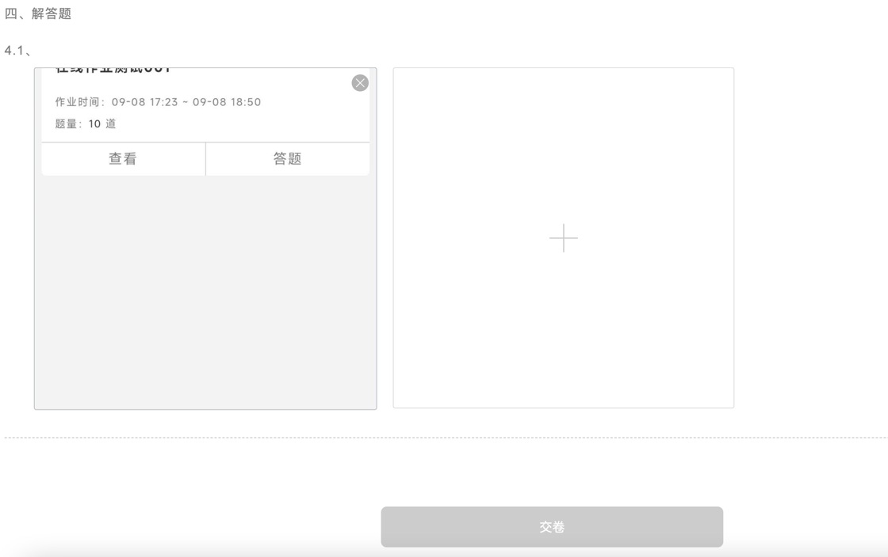
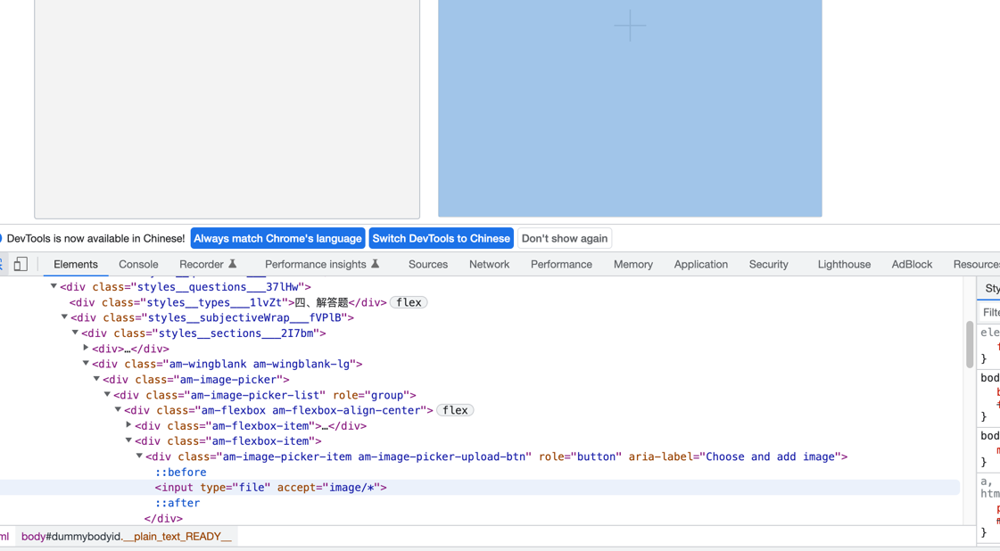

# APP WebView 无法浏览选择上传图片

运营找来说，配的第三方的链接，里面无法上传图片

拿到 url, 分析了下，一个 html 标签， `<input type="file" accept="image/*">`

这里是一个 文件上传的东西。 

然后搜了下， 发现一个解决方案。 

[<input type="file"> - HTML（超文本标记语言） | MDN](https://developer.mozilla.org/zh-CN/docs/Web/HTML/Element/Input/file)

[Android WebView <input type="file"> not working - Stack Overflow](https://stackoverflow.com/questions/62619834/android-webview-input-type-file-not-working)

关键点就是要自己处理  

参考： [(55条消息) 解决WebView文件上传无法重复选择问题_一叶飘舟的博客-CSDN博客](https://blog.csdn.net/jdsjlzx/article/details/115128848)
    补充： [Android Webview onShowFileChooser 无法重复调用问题 - 简书](https://www.jianshu.com/p/b360adb4000d)

[webview图片文件上传兼容性问题——上传控件点击无效的解决办法 | Mr.Onion](https://mronion0603.github.io/myblog/android/2017/07/20/android-webview-upload/)
[android - Why openFileChooser in WebChromeClient is hidden from the docs? Is it safe to use this method? - Stack Overflow](https://stackoverflow.com/questions/30078217/why-openfilechooser-in-webchromeclient-is-hidden-from-the-docs-is-it-safe-to-us)

 