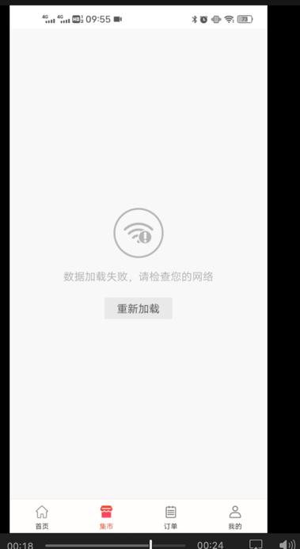
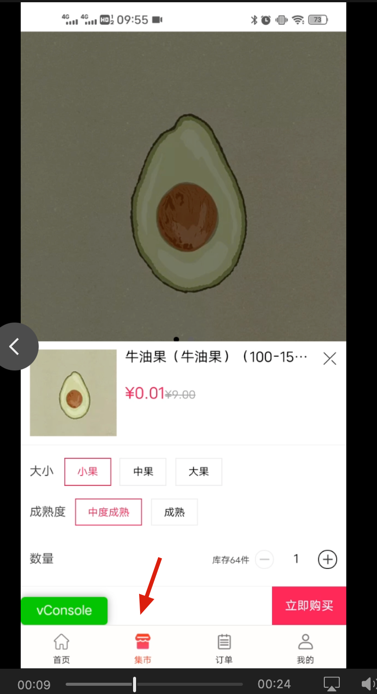
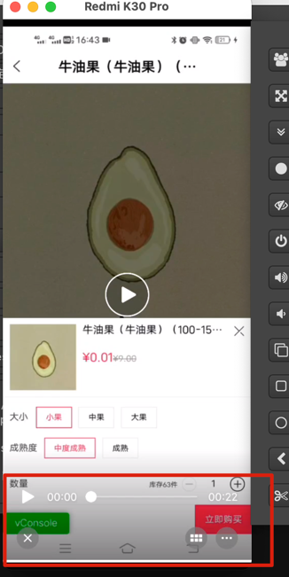

## 现象
早上测试告诉我，st 的商城 webview 中支付出问题了，效果如下。


## 排查路径
因为最近h5商城在改版， 所以怀疑是h5 改版造成的， 让测试找前端开发，
但是测试合前端都说改的东西不会影响到支付， 且 ios / 小程序都是正常的，那么我只能去排查问题。

 - 1 确定线上环境是否正常，确定线上环境是正常的
 - 2 st 环境支付不正常。

### 通过 打印 log,和打断点确定

执行到了这里
```
   // onReceivedError 调用位置在 shouldOverrideUrlLoading后面
        @RequiresApi(api = Build.VERSION_CODES.M)
        @Override
        public void onReceivedError (WebView view, WebResourceRequest request, WebResourceError error) {
            CustomProgress.closeprogress();
            if(error.getErrorCode() == ERROR_REDIRECT_LOOP){
                return;
            }
            isErrror = true;
//            isErrrorFinished = true;
        }
```

修改代码，打印更多的日志信息

修改的代码如下：

```
```

打印的信息如下：
** 支付宝支付**
```
BackHandledFragment: onReceivedError request:alipays://platformapi/startApp?appId=******&orderSuffix=h5_route_token%*********XmobilecashierR******is_h5_route*******#Intent;scheme=alipays;package=com.eg.android.AlipayGphone;end
BackHandledFragment: onReceivedError Descrip:net::net::<unknown>
BackHandledFragment: onReceivedError Code:-10
```

** 微信支付**
```
BackHandledFragment: onReceivedError request:weixin://wap/pay?prepayid%********&package=******&noncestr=****&sign=******
BackHandledFragment: onReceivedError Descrip:net::net::<unknown>
BackHandledFragment: onReceivedError Code:-10
```


### 寻找有用的报错信息

`Descrip:net::net::<unknown>`没有太多的参考价值，

Error Code

进入 com.tencent.smtt.sdk;

报错信息表如下
```
public class WebViewClient {
    public static final int ERROR_UNKNOWN = -1;
    public static final int ERROR_HOST_LOOKUP = -2;
    public static final int ERROR_UNSUPPORTED_AUTH_SCHEME = -3;
    public static final int ERROR_AUTHENTICATION = -4;
    public static final int ERROR_PROXY_AUTHENTICATION = -5;
    public static final int ERROR_CONNECT = -6;
    public static final int ERROR_IO = -7;
    public static final int ERROR_TIMEOUT = -8;
    public static final int ERROR_REDIRECT_LOOP = -9;
    public static final int ERROR_UNSUPPORTED_SCHEME = -10;
    public static final int ERROR_FAILED_SSL_HANDSHAKE = -11;
    public static final int ERROR_BAD_URL = -12;
    public static final int ERROR_FILE = -13;
    public static final int ERROR_FILE_NOT_FOUND = -14;
    public static final int ERROR_TOO_MANY_REQUESTS = -15;
    public static final int INTERCEPT_BY_ISP = -16;
```
得到： public static final int ERROR_UNSUPPORTED_SCHEME = -10; 和-10 匹配上了。

由于js页面自定义了 **scheme**，类似的还有alipays://，weixin:// 等等。而webView只能识别http://或https://开头的url，因此才会报此错。
想处理也很简单，对于这种自定义scheme的url单独处理即可。
以baidumap://为例，修改代码如下：

```typescript
webView.setWebViewClient(new WebViewClient(){
            @Override
            public boolean shouldOverrideUrlLoading(WebView view, String url) {
 
                try{
                    if(url.startsWith("baidumap://")){
                        Intent intent = new Intent(Intent.ACTION_VIEW, Uri.parse(url));
                        startActivity(intent);
                        return true;
                    }
                }catch (Exception e){
                    return false;
                }
                webView.loadUrl(url);
                return true;
            }
        });
```

以上就从原理层吧问题集市清楚了。


但是为什么线上版本 webview 商城没有问题，而 st 环境webview 商城就有问题了？

## 具体的原因是
有两个界面有 webView,

- MainActivity-BackHandledFragment  shouldOverrideUrlLoading中没有针对 scheme 的解析跳转
- AbsWebViewActivity    shouldOverrideUrlLoading中有针对 scheme 的解析跳转

线上环境是，BackHandledFragment 仅仅负责展示商品列表，不负责支付，   当点击加入购物车，或者立即购买时，就会跳转到AbsWebViewActivity 中支付。


但是 st 环境， 前端工程师做了修改，在 BackHandledFragment  当点击加入购物车，或者立即购买时，没有跳转，直接在BackHandledFragment中支付，调起
支付宝、或者微信， 但是BackHandledFragment 没有解析 scheme,所以就会有文档开头的问题。

这是有问题的界面，MainActivity-BackHandledFragment


这是正常情况下的界面，AbsWebViewActivity

